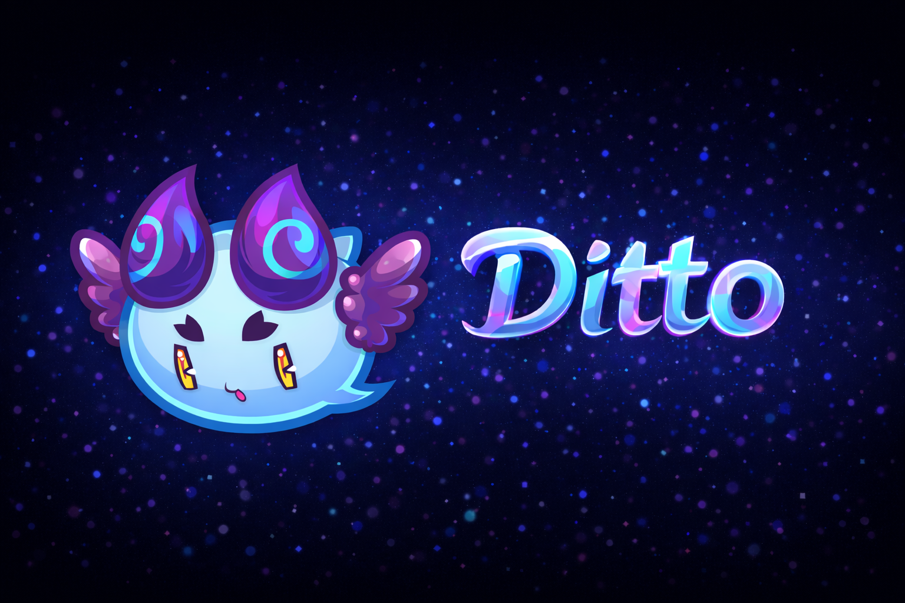

### Ditto-Engine

[中文版本](README_zh.md)

Ditto is a small self-developed C++ game engine/editor. It uses a GameObject tree
with component-driven behavior, JSON scene save/load, prefab assets, a Vulkan-first RHI with
OpenGL fallback, GPU instancing, C# scripting through Mono, 2D/3D physics, audio,
materials, shaders, and an ImGui-based editor.

## Build

Open `Ditto.sln`, select `x64`, then build `Debug` or `Release`.
The command-line helper uses the same Visual Studio/MSBuild path:

```powershell
python build_editor.py
```

Optional dependencies:

- Vulkan SDK: enables the Vulkan renderer when `VULKAN_SDK` is available, and makes it the preferred runtime backend.
- Assimp: enabled when `Ditto/3rdParty/Assimp` contains headers and `assimp-vc143-mt.lib`.
- .NET SDK: builds the C# scripting API in `Ditto/3rdParty/Mono`.

## Tests

```powershell
powershell -ExecutionPolicy Bypass -File Ditto/Tests/RunFullTests.ps1
```

The test script builds `DittoTests` and `DittoRenderSmoke` from `Ditto.sln`
through MSBuild, then runs file/scene, C# scripting, simulation, and OpenGL/Vulkan
render smoke coverage.




