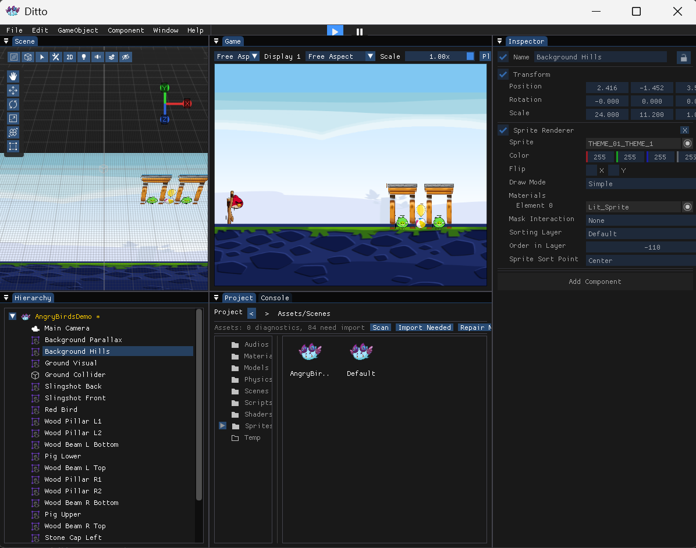

# Ditto Engine

[English Version](README.md)

Ditto 是一个偏 Unity 工作流的小型 C++ 游戏引擎和编辑器。它包含 GameObject/Component 场景模型、Mono/C# 脚本、自研 RHI 渲染层（DirectX 12 / Vulkan / OpenGL）、材质和 Shader、2D/3D 物理、音频、UI、Prefab、项目资产管理，以及基于 ImGui 的编辑器。

当前项目以 Windows 为主。Windows 编辑器和 Windows 桌面打包是目前支持的目标。Android 目标已经在构建 UI 中可见，但 Android runtime/exporter 还没有实现。



## 功能概览

- 编辑器：Hierarchy、Inspector、Project、Scene/Game 视图、Gizmo、资产预览、布局保存、项目创建、Windows 打包。
- 场景系统：GameObject 树、Transform、Camera、Renderer、SpriteRenderer、UI、C# Script 组件、Prefab、二进制/JSON 场景工具。
- 渲染：RHI 抽象层，支持 DX12/Vulkan/OpenGL；RenderTarget；材质/Shader 资产；Mesh/Sprite 渲染；GPU Instancing；编辑器 ImGui 渲染。
- 脚本：类似 Unity `MonoBehaviour` 的 C# 脚本、序列化字段、脚本编译、`Start`/`Update`/`FixedUpdate`，以及 Input、Transform、Camera、UI、Audio、Particle、Animator 等 native binding。
- 输入：native 共享键码，并朝 C# `KeyCode` / mouse API 的方向整理。
- 物理：2D/3D 物理组件、Collider、Rigidbody、物理材质、Raycast helper。
- 音频：基于 miniaudio 的 AudioSource。
- 测试：native 单元测试和 OpenGL/Vulkan/DX12 render smoke。

## 目录结构

```text
Ditto/
  Editor/                 编辑器窗口、构建系统、Inspector 控件
  Engine/
    Core/                 引擎循环、Scene、GameObject、Input、C# bridge
    Graphics/
      RHI/                Renderer 接口和 GL/Vulkan/DX12 后端
      Shaders/            Shader 资产解析和编译
      UI/                 屏幕空间 UI renderer 和字体图集
    Physics/              2D/3D 物理和碰撞
    Audio/                miniaudio 封装
    Resources/            资产路径、资产数据库、引用读写
  Assets/                 内置 Shader、材质、图标、Sprite、模型
  3rdParty/               GLFW、GLAD、ImGui、GLM、Mono、Assimp 等第三方库
  Tests/                  native tests 和 render smoke
Projects/                 示例/本地项目目录
x64/                      Visual Studio 输出目录，git 忽略
```

## 环境要求

构建 native editor 必需：

- Windows 10/11。
- MSVC C++ 工具链，当前工程使用 `PlatformToolset v143`。
- Windows 10/11 SDK。DX12 使用 Windows SDK 里的 `d3d12.lib`、`dxgi.lib`、`dxguid.lib`，不需要单独安装旧版 DirectX SDK。

可选（推荐）：

- .NET SDK — 仅当您希望引擎构建/重新生成 C# 运行时 DLL 并编译 C# 脚本时才要。
- Vulkan SDK — 用于 Vulkan 后端，并提供着色器工具链使用的 `dxc.exe`/`spirv-cross.exe`。

## 构建

打开 `Ditto.sln`，选择 `x64` 平台，构建 `Debug` 或 `Release`。

命令行：

```powershell
python build_editor.py
```

或直接调用 MSBuild：

```powershell
& "D:\Visual Studio 2022\MSBuild\Current\Bin\MSBuild.exe" Ditto.sln `
  /p:Configuration=Debug /p:Platform=x64 /t:Ditto /m:1 /v:minimal /nologo
```

常用构建开关：

```powershell
/p:EnableDX12=false
/p:EnableVulkan=false
/p:EnableAssimp=false
```

## 运行

编辑器输出路径：

```text
x64/Debug/Ditto.exe
```

运行时 RHI 默认顺序：

```text
DirectX 12 -> Vulkan -> OpenGL
```

可以用 `DITTO_RHI` 强制指定：

```powershell
$env:DITTO_RHI = "dx12"
$env:DITTO_RHI = "vulkan"
$env:DITTO_RHI = "opengl"
.\x64\Debug\Ditto.exe
```

## 测试

完整测试：

```powershell
powershell -ExecutionPolicy Bypass -File Ditto/Tests/RunFullTests.ps1
```

手动构建并运行 render smoke：

```powershell
& "D:\Visual Studio 2022\MSBuild\Current\Bin\MSBuild.exe" Ditto\Tests\DittoRenderSmoke.vcxproj `
  /p:Configuration=Debug /p:Platform=x64 /p:PreBuildEventUseInBuild=false `
  /m:1 /v:minimal /nologo

Ditto\Tests\x64\Debug\DittoRenderSmoke.exe --backend dx12   --out TestOutput\RenderSmokeDX12
Ditto\Tests\x64\Debug\DittoRenderSmoke.exe --backend vulkan --out TestOutput\RenderSmokeVK
Ditto\Tests\x64\Debug\DittoRenderSmoke.exe --backend opengl --out TestOutput\RenderSmokeGL
```

render smoke 会创建 3D cube、2D sprite 和 UI image，渲染到离屏 RenderTarget，读回像素并输出 `render.ppm`、`render.scene.json`、`render.pixels.json` 等诊断文件。
